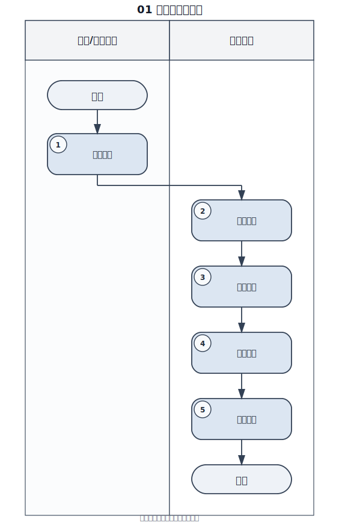

# Skill

面向真实业务场景的 Codex 技能仓库。

当前核心技能：

- [`swimlane-diagram`](./skills/swimlane-diagram)

这个技能解决的不是“流程能不能画出来”，而是“流程图能不能直接拿去用”。

很多方案只能输出 Mermaid 或 PlantUML 源码，逻辑能表达，但成品感不足。`swimlane-diagram` 默认输出标准 `SVG` 泳道图，目标是直接进入制度文档、SOP、培训材料、知识库和汇报场景。

## 为什么值得用

- 默认交付 `SVG` 成品图，而不是草图源码
- 风格更接近 draw.io / 正式业务流程图
- 面向企业管理、审批协同、交付运营等场景优化
- 强调泳道边界、节点对齐、箭头贴边和连线克制
- 明确支持 `PlantUML` 与 `Mermaid` 作为兼容输出

## 效果示例

示例目录：

- [线索管理泳道图示例](./examples/swimlane-diagram/lead-management/README.md)

示例图：

## 适合场景

- 企业管理流程
- SOP / 操作规范
- 审批流
- 合同流
- 采购流
- 交付流
- 客户流程
- 跨部门协同流程

## 快速使用

- `用 $swimlane-diagram 把这个流程做成标准 SVG 泳道图`
- `用 $swimlane-diagram 按企业管理模板生成成品图`
- `用 $swimlane-diagram 参考 draw.io 风格出图`
- `用 $swimlane-diagram 输出 PlantUML 版本`

## 仓库结构

- [`skills/`](./skills/): 技能本体
- [`docs/`](./docs/README.md): 介绍、安装和使用文档
- [`examples/`](./examples/README.md): 示例流程与成品图

## 文档入口

- [文档总览](./docs/README.md)
- [技能总览](./skills/README.md)
- [安装与使用](./docs/swimlane-diagram-install.zh-CN.md)
- [技能简介](./docs/swimlane-diagram-overview.zh-CN.md)
- [详细介绍](./docs/swimlane-diagram-intro.zh-CN.md)

## 适合持续沉淀

这个仓库不是只适合做一张图。它更适合把招聘、合同、采购、交付、售后、客户流程逐步沉淀成统一风格的流程图资产。

如果你也在做企业流程标准化、制度建设或知识库沉淀，这个技能会比普通 Mermaid 方案更实用。
