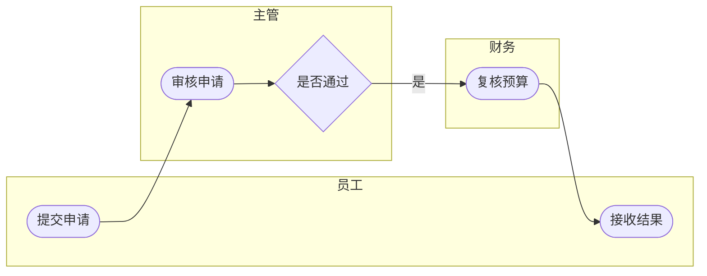

# Mermaid Swimlane Compatibility Notes

Mermaid does not provide a strong formal swimlane notation comparable to standard cross-functional diagrams.

Use Mermaid only when:

- the user explicitly needs Obsidian-native rendering
- editability inside Markdown is more important than formal presentation quality

## Rules

- Treat Mermaid as a compatibility format.
- Keep lane count low.
- Keep branching minimal.
- Do not claim it is a formal standard swimlane representation.
- Prefer one main path and short exception branches.

## Minimal Template

This is acceptable as a lightweight Markdown diagram, not as the preferred formal swimlane output.
