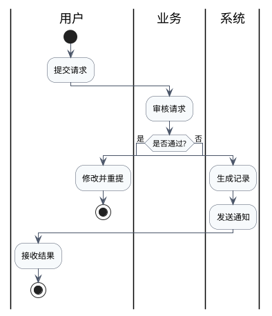

# PlantUML Swimlane Patterns

Use this file for standard swimlane output.

## Why PlantUML

For swimlane diagrams, PlantUML activity diagrams with partitions are more suitable than Mermaid because they:

- support clearer lane structure
- produce more standard business-flow visuals
- handle decisions and handoffs with less visual noise

## Standard Template

## Lane Rules

- 1 lane = 1 stable owner category
- use role/team/system names, not personal names
- keep lane names short
- use 2-6 lanes

## Node Rules

- 1 box = 1 action
- start with `start`
- end with `stop`
- use short action phrases
- decisions must be explicit and minimal

## Layout Rules

- main flow should read top-down or in a stable ordered path
- avoid crossed arrows where possible
- keep rejection or retry loops compact
- if there are too many exceptions, split into multiple diagrams

## Styling Rules

- default to restrained styling
- light fills, dark borders
- no gradients
- no decorative icons
- use color only to improve scanability, not decoration
